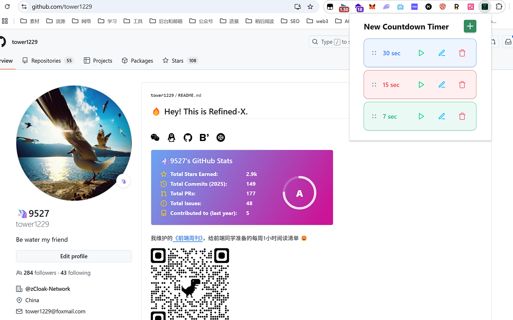
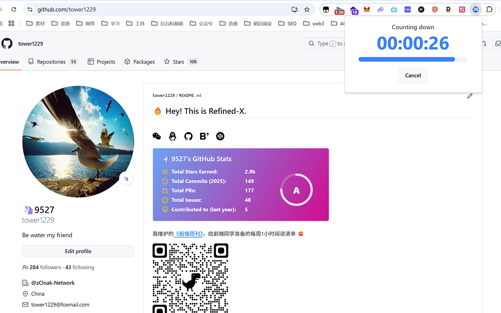
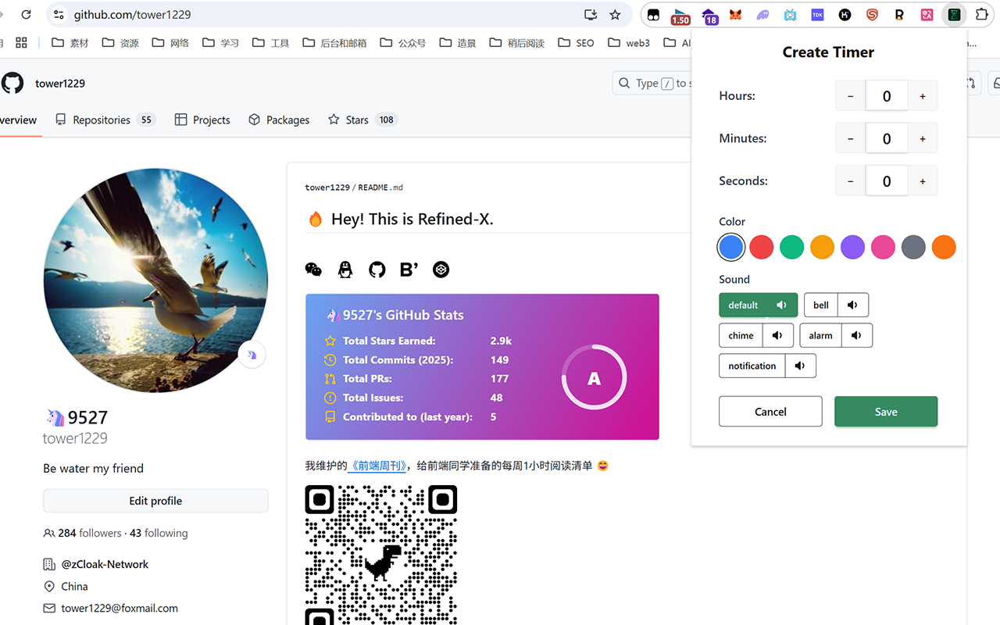

# 

# Countdown Timer 浏览器扩展程序

> **一款为专注和效率而设计的多功能多定时器工具。**

---

## 🚀 简介

**Countdown Timer** 是一款功能强大且高效的浏览器扩展程序，用于管理多个倒计时。它提供可自定义的定时器、实时工具栏更新、专注倒计时视图和强大的隐私保护。适用于工作时段、学习间隔、烹饪、锻炼或任何需要精确时间管理的任务。

---

## ✨ 主要特性

- **多定时器管理**：为重复性任务创建、保存、编辑和删除多个自定义定时器。
- **拖放排序**：轻松重新排列您保存的定时器，以适应您的工作流程。
- **个性化定制**：为每个定时器分配独特的颜色和通知声音，以便快速识别。
- **一键启动**：从列表中即时启动任何已保存的定时器。
- **动态工具栏图标**：扩展程序图标动态显示活动倒计时的剩余时间。
- **专注倒计时视图**：在活动倒计时期间，弹出窗口仅显示计时器，最大限度地减少干扰。列表视图在完成后恢复。
- **通知提醒**：当计时器完成时，接收桌面视觉通知和音频警报。
- **云同步（可选）**：使用浏览器内置的同步功能（使用 `chrome.storage.sync`）在多个设备之间无缝同步您的自定义定时器。
- **直观设计**：遵循 Material Design 原则的简洁、用户友好的界面。
- **注重隐私**：默认情况下，所有计时器数据都存储在本地（使用 `chrome.storage.local`）。云同步是可选的，并使用 `chrome.storage.sync`。不会在其他任何地方跟踪或传输数据。

---

## 🖼️ 界面预览

<div align="center">
   
   
  
  
</div>

---

## 📦 安装方式

### 方式一：从应用商店安装（推荐）

- **[Chrome 应用商店链接](https://chromewebstore.google.com/detail/new-countdown-timer/bidfonlkphldhabglikfailiocajegmn?authuser=0&hl=zh-CN)**

- **[EDGE 应用商店链接](https://microsoftedge.microsoft.com/addons/detail/new-countdown-timer/inneoamppnbnoddhjapeeecilobndfpp)**

### 方式二：手动安装（适用于开发者）

1.  **克隆仓库：**
    ```bash
    git clone https://github.com/tower1229/countdown-chrome.git
    cd countdown-chrome
    ```
2.  **安装依赖：**
    ```bash
    yarn install
    ```
3.  **构建扩展程序：**
    ```bash
    yarn build
    ```
    这将在项目根目录下创建一个 `dist` 文件夹，其中包含构建好的扩展程序文件。
4.  **在 Chrome/EDGE 中加载扩展程序：**
    - 打开浏览器并访问 `chrome://extensions/`。
    - 在页面右上角，打开"开发者模式"开关。
    - 点击"加载已解压的扩展程序"按钮。
    - 选择在第 3 步中创建的 `dist` 文件夹。

---

## 🛠️ 使用方法

1.  **安装** 扩展程序（使用上述任一方式）。
2.  **固定到工具栏**：点击扩展程序图标（拼图形状），然后将"Countdown Timer"固定到工具栏，以便快速访问。
3.  **创建/管理定时器**：点击扩展程序图标打开弹出窗口。创建新定时器或管理现有定时器，自定义时间、颜色和声音。
4.  **启动倒计时**：点击列表中任何计时器旁边的启动按钮。
5.  **监控进度**：在工具栏图标或专注的弹出视图中观察剩余时间。
6.  **接收通知**：当计时器完成时，会收到桌面通知和声音提醒。

---

## 🛡️ 隐私与安全

- **本地存储**：默认情况下，所有定时器配置都安全地存储在您的本地计算机上，使用 `chrome.storage.local`。
- **可选云同步**：如果启用，数据将通过 `chrome.storage.sync` 在您的设备之间同步。
- **无跟踪**：本扩展程序不会收集、传输或共享任何个人数据或使用信息。
- **最小权限**：仅申请运行所需的最少权限。
- **内容安全策略 (CSP)**：已实施以增强安全性。

有关更多详细信息，请参阅我们的[隐私政策](docs/privacy-policy.md)。

---

## 📜 许可证

本项目根据 MIT 许可证授权。有关详细信息，请参阅 [LICENSE](LICENSE) 文件。

---

## 💖 支持与贡献

发现错误或有功能建议？请在 [GitHub 仓库](https://github.com/tower1229/countdown-chrome/issues) 上提交 issue。欢迎贡献代码！
